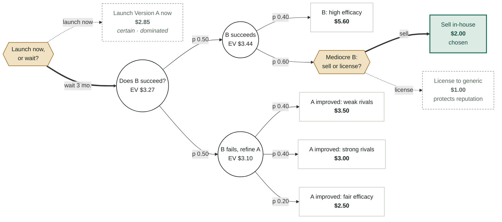

# Launch Now or Wait? — Merck Version A vs Version B

Solid/thick arrows = the EV-optimal branch at each decision. Dotted arrows = the dominated alternative. Diamonds = calls Merck makes; circles = outcomes nature resolves; rectangles = terminal payoffs ($/dose).

**Recommendation:** wait for Version B — EV $3.27/dose vs. $2.85 for launching now, a $0.42 (~15%) edge, after choosing to sell any mediocre B in-house rather than license it.
